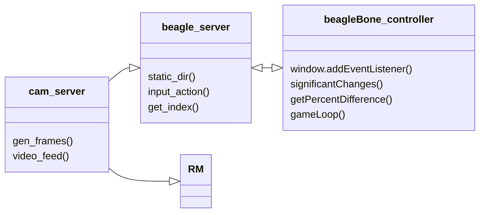

# CS 321 - Project Race Car 

## Introduction:

This is the git hub page for Group 5. Repository used to keep baseline for CS321's term long project integrated. Here we will keep documentation and source code. (We will add more to this page.)

## Group 5 Team Members:

* Ben
* Other Ben (You guys figure this one out)
* Scott
* Nick
* Shaun
* Chris
* Baxter 

---
## Technology

The technology used in this project consists of the following:

* Front-end:
  * Javascript 
    -gamepad API    
  * HTML
  * Live Server
* Backend:
  * Python
    * version 3.10
  * PIP - Package Manager
  * flask
* TBD(CI/CD)
  * Currently looking at automation software(Jenkins, Gitlab, etc.) .This is an extra credit and optional requirement listed in the project pdf. I have used this before and would like to personally set this up. Not needed but seems like a fun thing to have.
  
---

## Hardware

The hardware used for this project consists of:
* Beagle Bone Black
* USB Controller: Xbox One Controller
* RACE CAR MACHINE

---
## Project Structure

THis will be a skeleton structure of the project. please feel free to add and remove as needed. 

* src/frontend
  *  This is where all the frontend, graphical interface should be place. If humans are physically manipulating it, this is the folder it should go in.
* src/backend
  *  Pretty much everything else will fall under here for now. It will have several sub-folder in the future.

---

Class Diagram:

## Running the Software and Connecting to the Server
1. SSH into two sessions on the Beagle Board you wish to run this software from.
2. On the first SSH session, clone this repo to the location of your choosing and then navigate into the `racecar/src/backend/Networking/` directory
3. From there, execute the following command: `python3 beagle_server.py`. This will start up the web server on port 5000 that a user can connect to in order to control the racecar.
4. In the second SSH session, execute the following command: `ffmpeg -c:v mjpeg -s 640x360 -i /dev/video0 -c:v copy -tune zerolatency -muxdelay 0.1 -g 0 -f mjpeg udp://RACE_IP:33113`. This will start the video stream.
5. On a computer on the same network as the beagle board, use a web browser to navigate to the IP address of the beagle board at port 5000. We set our beagle board to have the static IP address of 192.168.8.50, so our connection string looked like: http://192.168.8.50:5000
6. Upon plugging in a controller to the now-connected computer and the beagle board receiving a start signal from Race Management, you should be able to control the racecar with joystick inputs until such time as Race Management sends the race stop signal.
7. The software can be killed in the two SSH sessions with the typical Control-C key press on the keyboard.

---
## Miscellaneous

* Connection info for Professor Pettit's provided wi-fi access point:
  * SSID: GL-A1300-97b
  * Password: W3JZ7Q295M

* SSH info:
  * Host (if connecting via the above wi-fi acces point provided by the professor): 192.168.8.50
  * Host (if connecting via USB connection): 192.168.7.2
  * User name is one of the following based on our team members' names: baxter, ben_s, ben_t, chris, nick, scott, shaun
  * Note that the username debian is disabled for security reasons so other teams are less likely to be able to access our BeagleBone
  * Default Password (you will be asked to change this upon first login): temppwd
